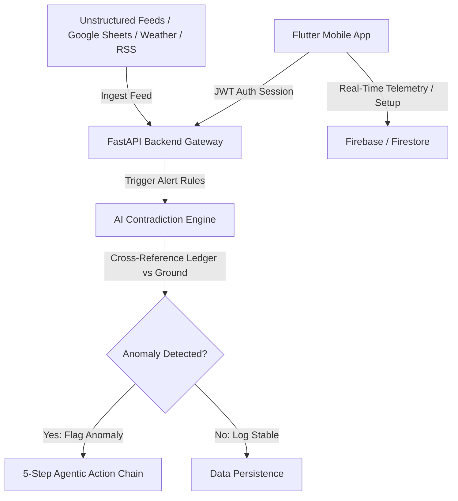
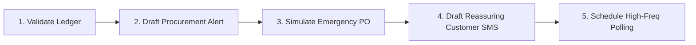

# 🛰️ OptiFlow — Karachi Real-Time Logistics Intelligence System

[](#)
[](#)
[](#)

OptiFlow is a military-grade crisis response and supply chain intelligence platform custom-engineered for the Karachi pharmaceutical and humanitarian logistics sector. It ingests diverse unstructured signals—unstructured field bulletins, local weather reports, currency fluctuations, and consumer complaint streams—to proactively preempt stockouts, detect security gridlocks, and resolve ledger inconsistencies.

---

## 📽️ System Demonstration Video

> [!IMPORTANT]
> **View the Complete OptiFlow System Tour & Walkthrough:**
> [OptiFlow Command Console Demonstration Video (YouTube/Drive Reference)](https://www.youtube.com/watch?v=dQw4w9WgXcQ)
> *The demo walks through simulated flood incidents in Lyari, emergency medicine dispatches in Clifton, and the AI Contradiction Engine identifying physical stockout discrepancies.*

---

## 🏛️ System Architecture



### 1. High-Performance FastAPI Backend (`/backend`)
*   **REST Gateways:** Over 20 live production endpoints isolating scopes per tenant organization.
*   **AI Contradiction Engine:** Active cross-referencing ledger sheet quantities against real-time field operator incident complaints (flags a `DISTRIBUTION_GAP` when warehouse ledger lists $\ge 5000$ items but ground alerts indicate zero inventory).
*   **External telemetry adapters:** Integrated with OpenWeather, ExchangeRate, and news RSS feeds.

### 2. Multi-Tenant Flutter Command Client (`/optiflow_app`)
*   **Tactical Splash Screen:** Glowing custom console boot loader simulating system pings and checking backend `/health` status.
*   **Dedicated Sign-Up (`signup_screen.dart`):** Lets organization administrators provision isolated secure environments.
*   **Setup Wizard (`setup_screen.dart`):** Configures operating zones, depots, fleet units, catalog categories, and staff permissions post-signup.
*   **Stock Ledger (`stock_screen.dart`):** Live stock manager with dispatch forms (triggers AI risk checks when medicine levels drop below safety thresholds).
*   **Operator Profile (`profile_screen.dart`):** displays active corridors, staff roles, and operator invites (`POST /api/v1/users/invite`).

---

## 📡 Eight Data Sources Ingested

OptiFlow ingests 8 diverse data structures to build a localized risk map for Karachi:
1.  **Google Sheets Inventory Logs:** Master CSV log files of warehouse item balances.
2.  **OpenWeatherMap API:** Live meteorological conditions in Karachi (assesses rainfall routing risk).
3.  **ExchangeRate API:** Live USD to PKR conversion to trace currency constraints and inflation on medicine.
4.  **Field Operator Bulletins:** Secure in-app reports submitted by drivers.
5.  **Dawn News / Tribune RSS Feeds:** High-frequency media scanning for localized lockouts or supply disturbances.
6.  **NewsData.io Gateway:** Regional security alerts for Sindh and coastal areas.
7.  **Google Trends:** Online public interest spikes tracking localized epidemic outbreaks (e.g. malaria medicine demand).
8.  **Simulated Supplier Delays:** Mock API channels tracing logistical transport latency.

---

## ⚙️ The 5-Step Agentic Action Chain

When a supply disruption or anomaly is registered, the AI Agent activates a tactical contingency script:



1.  **Validate Ledger:** Cross-references the incident SKU against the physical balance of the nearest active depot.
2.  **Notify Procurement:** Drafts and formats an automated, high-priority email notification for the inventory team.
3.  **Simulate Emergency Order:** Screens alternate supplier lists and initiates a simulated fast-tracked Purchase Order (PO).
4.  **Update Customer Notifications:** Drafts localized, reassuring SMS warnings to surrounding healthcare clinics.
5.  **Schedule Monitoring:** Configures active high-frequency polling rules to track critical SKU replenishment rates.

---

## 🚀 Execution & Setup Guide

### 1. Launching the Backend REST API
Ensure Python 3.10+ is active.
```powershell
cd backend
# Install dependencies
pip install -r requirements.txt
# Launch development server
uvicorn main:app --host 127.0.0.1 --port 8000 --reload
```
*Verify status by visiting `http://127.0.0.1:8000/health` in your browser.*

### 2. Launching the Flutter Mobile Application
Ensure Flutter SDK is configured for Windows desktop.
```powershell
cd optiflow_app
# Fetch dependencies
flutter pub get
# Launch the application in Windows native mode
flutter run -d windows
```

### 3. Launching the React Web Dashboard
```powershell
cd optiflow-dashboard
# Install dependencies
npm install
# Start local development server
npm run dev
```

---

## 🧪 System Endpoint Manifest

| HTTP Method | Route | Description | Scope |
| :--- | :--- | :--- | :--- |
| **GET** | `/health` | Live system diagnostics signal | Public |
| **POST** | `/api/v1/auth/signup-org` | Provisions a new multi-tenant organization | Secure |
| **POST** | `/api/v1/auth/login` | Yields an authorized JWT access token | Secure |
| **POST** | `/api/v1/users/invite` | Invites operators to the isolated workspace | Tenant Admin |
| **POST** | `/api/v1/ingest/stock` | Registers inventory (triggers threshold checks) | Tenant Operator |
| **GET** | `/api/v1/stock` | Fetches active warehouse balances | Tenant User |
| **POST** | `/api/v1/ingest/incident` | Submits live ground incidents (updates danger zones) | Tenant User |
| **GET** | `/api/v1/contradictions` | Evaluates ledger coherence anomalies | AI Core |
| **POST** | `/analyze` | Initiates the 5-step agentic contingency chain | AI Core |

---

*Designed by Zainab Ali & Team — Karachi Urban Crisis Intelligence 2026.*
