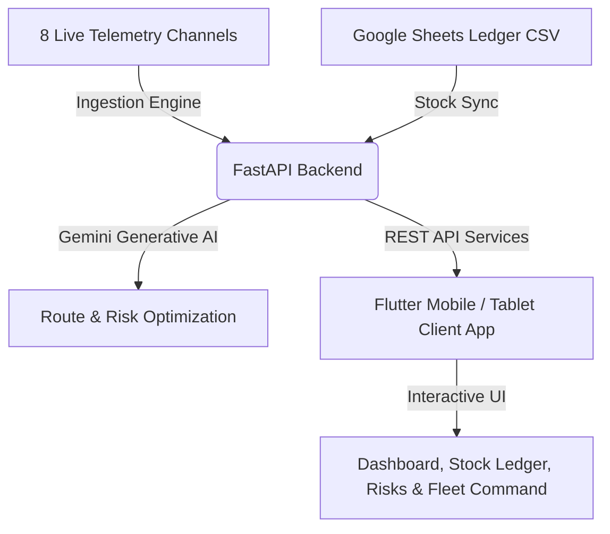

# Product Requirement Document (PRD)
## OptiFlow: AI-Powered Supply Chain & Fleet Command Center

> [!NOTE]
> This document outlines the technical specification, system architecture, core features, and product requirements for the OptiFlow real-time command dashboard.

---

## 1. Executive Summary & Objective
**OptiFlow** is a next-generation real-time logistics, stock ledger, and safety command application designed specifically for pharmaceutical distributors and warehouse operations in Karachi, Pakistan. 

By unifying **8 distinct live telemetry feeds** (weather, news, supplier delays, currency rates, media panic, and emergency services) with **AI-driven route optimization** and **automated Google Sheets inventory ledgers**, OptiFlow eliminates manual supply chain blindspots. It empowers warehouse dispatchers and logistics managers to instantly identify supply risks, route around blockages, and automate inventory replenishments before shortages arise.

---

## 2. Core Technical Architecture

### Technical Stack
* **Frontend Mobile/Tablet App:** Flutter (Dart), utilizing highly-responsive state management, high-contrast HSL theme system, and fully localized visual components.
* **Backend Control Center:** FastAPI (Python), handling asynchronous background threads for data scraping and live endpoint serving.
* **AI Engine:** Google Gemini Generative Model, responsible for analyzing multi-source risk profiles and generating optimal delivery routes.
* **Database & Ledger Integration:** Public Google Sheets CSV integration for warehouse stock ledger, local storage caches, and REST endpoints for session variables.

---

## 3. Product Features & Requirements

### A. Core Dashboard & Command Console
* **Objective:** Give the logistics coordinator a single, high-fidelity screen to review active KPIs and supply health.
* **Requirements:**
  * **Unified KPIs:** Real-time metrics showing Total Dispatch Movements, Active Supply Warnings, and Stock Restock Alerts.
  * **Direct Activity Stream:** Combines manual driver logs, supplier delays, and AI weather warnings into a scrollable, real-time log.
  * **Quick Navigation:** Instant access to inventory ledgers, fleet monitors, and risk feeds.

### B. Live Stock Ledger & Restock Engine
* **Objective:** Prevent inventory depletion by linking local warehouse stocks with custom Google Sheets CSV records.
* **Requirements:**
  * **Google Sheets Stock Sync:** Downloads external inventory databases (mapping custom columns like `qty_in_stock` to standard snake_case indices).
  * **Manager Dispatch Overrides:** Allows coordinators to manually record outgoing dispatches or restock shipments, instantly calculating net available stock.
  * **Restock AI Indicators:** Compares local levels against critical thresholds and highlights items requiring urgent restock.

### C. Safety & Supply Alerts (Risks Center)
* **Objective:** Replace generic incident logs with an active Logistics and Safety Risk Command Center.
* **Requirements:**
  * **8-Source AI Risk Ingestion:** Aggregates live warnings from Karachi weather, motorway closures, local media shortages, and emergency news.
  * **Noise Suppression:** Suppresses "normal state" reports. Warnings only appear on the active risk board if safety thresholds are breached (e.g. high-risk flooding, motorway blockages, protests, or critical stock trends).
  * **Resource Allocation Matrix:** An interactive control console listing dynamic delivery fleet units (Cold-Chain Vans, Heavy Trucks, Motorcycle Couriers) nearby.
  * **Context-Aware Dispatch Notification:** Tapping **"DISPATCH REINFORCEMENTS"** sends instant push orders to relevant drivers or depot crews tailored to the specific emergency type.

### D. Fleet & Route Intelligence
* **Objective:** Help fleet vehicles avoid urban hazards (protests, flooded underpasses, delays) using real-time generative route replanning.
* **Requirements:**
  * **Live Zone Risk Map:** Aggregates multi-source hazard reports into zone risk statuses (RED, YELLOW, GREEN) detailing average daily incidents and status.
  * **AI Route Optimization:** Sends active origin-destination inputs combined with live news and weather warnings to the Gemini AI API, returning step-by-step navigation detours.
  * **Driver Movement Logs:** Lets dispatchers log new vehicle transits (Driver Name, Vehicle ID, origin-destination zones, and SKU cargo).

---

## 4. Screen-by-Screen Visual Architecture

| Screen Name | Icon Indicator | Primary Interactive Components |
| :--- | :--- | :--- |
| **Dashboard** | `Icons.dashboard` | Live Activity Log, Quick KPIs, Risk Summary Map |
| **Stock Ledger** | `Icons.inventory_2` | Sync Status Banner, Stock Ledger DataTable, Manual Override Form |
| **Risks & Alerts** | `Icons.warning_amber` | Zone Overview Board, 8-Source AI Active Feed, Resource Allocation Matrix |
| **Fleet Command** | `Icons.local_shipping` | Live Zone Risk Map, Interactive Route Planner (AI detours), Log Movement Dialog |
| **Analytics** | `Icons.analytics` | Risk Projections, Lead Time Forecasts, Active SKU Health Reports |

---

## 5. Security, Resilience & Compliance
1. **Resilient HTTP Timeout Policies:** All connections to third-party endpoints (Google Sheets, OpenWeatherMap) feature a minimum of `15.0s` connection timeouts with standard `User-Agent` headers to guarantee ingestion stability.
2. **Offline Fallback Modes:** If a live source or Google Sheet is offline, the backend seamlessly degrades to local cached records rather than triggering app crashes.
3. **Roles & Access Control:** REST API endpoints are protected using dependency-injected role checking (`admin`, `manager`, `pharma_admin`, `field_operator`) to verify session validation.

---

## 6. Future Scalability Roadmap
* [ ] **Live GPS Vehicle Ingestion:** Connect fleet maps to real-time mobile GPS pings.
* [ ] **Biometric Restock Approvals:** Secure manager dispatch overrides via FaceID/Fingerprint authentication.
* [ ] **Predictive Lead Time Analytics:** Utilize deep LSTM networks to forecast seasonal medicine delays based on multi-year weather trends.
